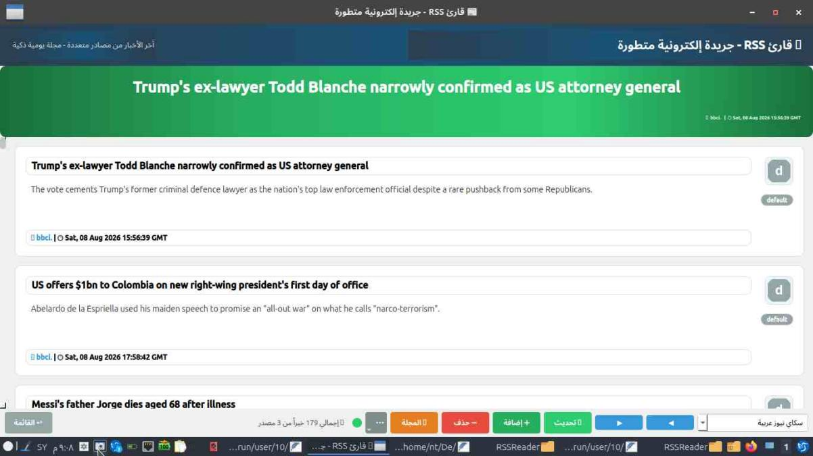
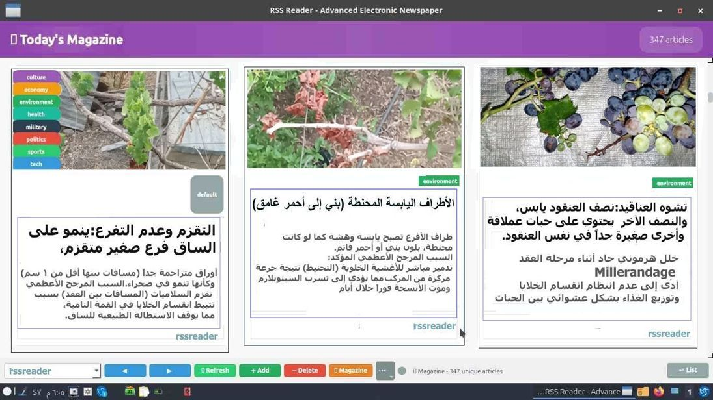

# 📰 RSSReader – Smart News Magazine

[](https://www.gnu.org/licenses/agpl-3.0)
[](https://www.qt.io/)
[](https://github.com/samermerhj/RSSReader)
[](https://github.com/samermerhj/RSSReader/releases)
  
## 💡 The Story

In a place you've never heard of, time stood still.
Everything there is still stuck in the past, even XP still runs on some machines.

I closed my camera, and my printer went silent.
No one visits me anymore.

I live an urban life in the heart of the countryside, while those around me live a nomadic life.
The difference was enough to build a silent wall between me and them.

In that harsh isolation, I returned to my old archive.
But this time, I wasn't looking for a film, but for primitive code for a personal tool I once built to gather world news.
I extracted it from the ruins of oblivion, and rebuilt it in today's style.

Now, that intention has become **Smart RSS**; a smart, powerful, and vibrant news magazine.

**This is code worth trying.** 🚀

I'm sharing the first version of this code as free software, under a strong license that protects my work and respects my effort.
Professional features will come later..


## ✨ Features (Free Version)

### 🌟 Core Features

| Feature | Description |
| :--- | :--- |
| 🌐 **Multi-source RSS Fetching** | Add any number of RSS feeds. |
| 🧠 **Smart News Grouping** | Similar articles are merged into one topic. |
| 📰 **Daily Magazine Mode** | Automated journalistic formatting with cards and images. |
| 📜 **Live News Ticker** | Smooth scrolling with transition effects. |
| 💾 **SQLite Archiving** | Search and browse past news by date. |
| 🎨 **Beautiful Interface** | Modern, clean, with smart category icons. |
| ⏰ **Magazine Scheduling** | For example, every day at 6 PM. |
| ⚡ **Fast and Offline-capable** | After fetching news, you can read offline. |
| 🖱️ **Full Text Display** | "Show More/Less" button to expand text within the card. |
| 🔗 **Open Link from Source** | Click on the source name to open the link directly. |
| 🌍 **Multi-language Support** | 5 languages: English (default), Arabic, French, Russian, Chinese. |

### 🔒 Coming in the Professional Version (Closed Source, Paid)

- 📦 Ready-made feed package (100+ global and Arabic sources).
- 🎨 Custom themes and icons.
- 📄 Print newspaper support.
- 📧 Early access to updates.
- 📧 Animated magazine images.
- 📧 Text-to-speech for news.

**Built with Qt/C++. Lightweight. No bloat.**

## 📸 Screenshots

<div align="center">
  
  <br/>
  <em>Main Interface – News Display</em>
</div>

<br/>

<div align="center">
  
  <br/>
  <em>Magazine Mode – News Cards Display</em>
</div>


## 📥 Download

**Version:** `1.0.0`

### Free Version (Open Source)

| Platform | File | Link |
| :--- | :--- | :--- |
| **Linux (.deb)** | `rssreader-qt_1.0.0_amd64.deb` | [Download](https://github.com/samermerhj/RSSReader/releases/latest) |
| **Linux (AppImage)** | `RSSReader_Qt-x86_64.AppImage` | [Download](https://github.com/samermerhj/RSSReader/releases/latest) |
| **Windows (.exe)** | `RSSReader_Qt.exe` | [Download](https://github.com/samermerhj/RSSReader/releases/latest) |
## 🛠 Building from Source

### Requirements:

| Library | Version |
| :--- | :--- |
| Qt | 5.15+ (Widgets, Network, Sql, Xml, Svg) |
| CMake | 3.10+ |
| C++ | 17+ |
| Fonts | `sudo apt install fonts-noto-color-emoji` (for emoji support) |

### Build Steps (Linux):


# 1. Clone the repository
git clone https://github.com/samermerhj/RSSReader.git
cd RSSReader

# 2. Create build directory
mkdir build && cd build

# 3. Run CMake (Release build)
cmake -DCMAKE_BUILD_TYPE=Release ..

# 4. Build
make -j$(nproc)

# 5. Run
./RSSReader_Qt


📦 Creating a .deb Package (Linux)


# 1. Create the structure
mkdir -p RSSReader/usr/bin
cp build/RSSReader_Qt RSSReader/usr/bin/

mkdir -p RSSReader/usr/share/RSSReader/resources
cp -r resources/* RSSReader/usr/share/RSSReader/resources/

mkdir -p RSSReader/usr/share/RSSReader/translations
cp translations/*.qm RSSReader/usr/share/RSSReader/translations/

mkdir -p RSSReader/usr/share/icons/hicolor/scalable/apps/
cp icons/tray_icon.svg RSSReader/usr/share/icons/hicolor/scalable/apps/rssreader.svg

# 2. Create control file
mkdir -p RSSReader/DEBIAN
cat > RSSReader/DEBIAN/control << EOF
Package: rssreader-qt
Version: 1.0.0
Section: utils
Priority: optional
Architecture: amd64
Depends: libqt5core5a, libqt5gui5, libqt5widgets5, libqt5network5, libqt5sql5, libqt5xml5, libqt5svg5
Maintainer: Samer Merhj <mjosak7@gmail.com>
Description: RSSReader - Smart News Magazine
 Advanced RSS reader supporting multiple sources, daily magazine, and translation.
Homepage: https://github.com/samermerhj/RSSReader
EOF

# 3. Build the package
dpkg-deb --build RSSReader/
📦 Creating an AppImage (Portable)


# 1. Download linuxdeployqt
wget https://github.com/probonopd/linuxdeployqt/releases/download/continuous/linuxdeployqt-continuous-x86_64.AppImage
chmod +x linuxdeployqt-continuous-x86_64.AppImage

# 2. Prepare files
mkdir -p AppDir/usr/bin
cp build/RSSReader_Qt AppDir/usr/bin/
cp -r resources AppDir/usr/share/RSSReader/
cp -r translations AppDir/usr/share/RSSReader/
cp icons/tray_icon.svg AppDir/rssreader.svg

# 3. Create AppImage
./linuxdeployqt-continuous-x86_64.AppImage AppDir/usr/bin/RSSReader_Qt -appimage


📄 License

This software is free software under the GNU Affero General Public License version 3.0 (AGPLv3).

What does this mean?

✅ You can ⚠️ You must ⛔ You cannot
Use it for any purpose. If you distribute a modified version, open your source code under AGPLv3. Sell this software or any modified version without explicit permission.
Study and learn from the source code. Keep the AGPLv3 license in every copy. Use it in closed-source software without a commercial license.
Share it with anyone. Indicate the changes you made. Remove copyright and license notices from the files.

For Commercial Use:

If you want to:

· Integrate the software into a commercial closed-source product.
· Modify the code without opening the source.
· Distribute the software commercially.

Contact me for a paid commercial license.
Open an Issue titled Commercial License or email me.


❤️ Support This Project

Your direct support helps me survive, pay the internet bill, and continue development.

You're seeing this, you'll be among the first to know about the professional version as soon as it launches.

👉 Support via Coindrop (https://coindrop.to/RSSReader)

₿ Direct Cryptocurrency Donation

Currency Address
Bitcoin (BTC) bc1qrh4nw70w5hyrg4myuppv879z6sp40lzvr9k69m


📞 Contact

Method Link
Email mjosak7@gmail.com
GitHub Issues Report Bugs
Commercial License Requests Open an Issue titled "Commercial License"
Repository https://github.com/samermerhj/RSSReader


🙏 Special Thanks

· Qt Framework – For providing a powerful and open development platform.
· Open Source Community – For inspiration and continuous support.
· Everyone who supports this project – You are the reason I keep going.


<p align="center">
  <b>Made with ❤️ by Samer Merhj</b>
  <br/>
  <sub>© 2026 – RSSReader – Smart News Magazine</sub>
</p>
```
